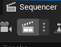

# Animation

First thing I had to do is import my models from Blender which opposed me to a few problems. 
Procedural materials from Blender can't be exported. 
Materials with textures not directly linked into the BSDF shader don't export correctly.

To solve those problems I needed to bake the materials inside textures.

 

# Texture baking

Back into Blender already !!

To bake materials with Blender, I need to create a new texture inside Blender. 
Then in each material used by the object I want to bake texture from. I add an **image texture** node and select the texture I created. (The node need to be selected in all materials used).

I also need to create a new UV map for baking the texture.
So I created a new UV map and did a "*smart UV project*" inside the UV editing tab.

> the image as normals baked in it because that the last thing I baked

 

With everything setup, I need to select the type I want to bake inside the **Render property** tab.
For all my models, I baked the **diffuse**, **roughness** and **normals**.
After each bake I need to **save as** the image on the disk.

 

With all the baked textures saved, the last step is to remove the materials of the object and create a new one that is gonna used the baked texture. To do that I use the **node-wrangler** like in the *Render Readme.md*.

 

# Importing

Now I can import my models (At least the simple ones). 
Here we can see the wooden crate and the wooden palette in Unreal.

 
Note: Unreal mixes the metallic and roughness when importing.
So I need to check that the roughness texture is connected to the roughness input like in the screenshot below.

 

## The robot

The robot is composed of a lot of separated object linked together by the armature, each having multiple materials. 
Surprinsingly, I didn't have to do much differently than how explained in the ***Baking*** section above. 
The animation exported without any problem (surprisingly).

The only problem was the metalicness that is needed for the robot but with the way my procedural material is working, I couldn't find how to bake it into a texture. 
So I improvised and used the black color in the texture as the metalicness. 
To do that I used this node setup below.

 

# The scene

I didn't use the same scene as the one of the *Render* because I had some problems importing some stuff and I was running out of time.

 

# Rendering the video

To render the video I use a few **sequencer** (one per sequence, a sequence being the camera moving from a point to another), and a **Sequence Master** where you put the sequencer in.

Finally, I press the *Render movie* button and setup the resolution, press **Render** and I get an out.avi file containing the movie.

