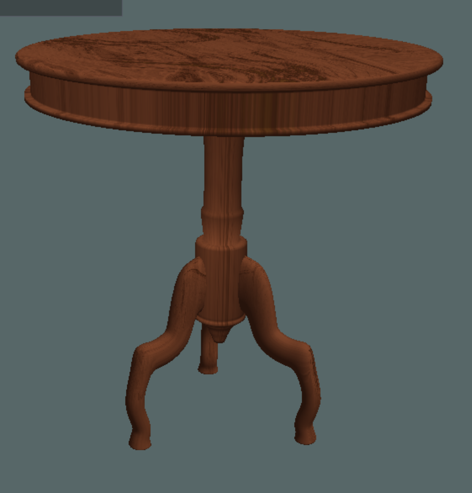

# Video

## Demo video (youtube)
https://www.youtube.com/watch?v=uJti37XhiEs

 

# The project

## Libraries used in this project (mandatories)

• GLFW Library (https://www.glfw.org) 
• GLAD Library (https://github.com/Dav1dde/glad) 
• Dear ImGUI (https://github.com/ocornut/imgui) 
• GLM Library (http://glm.g-truc.net) 
• Tiny GLTF (https://github.com/syoyo/tinygltf) 

## The project

This project is about make an interactive application using OpenGL and the librairies listed.
The goals are:
- import and draw models made in Blender from the Render assignement.
- Working materials, lights and shading
- Framebuffer effects (post-processing)
- An exploration camera
- Interactivity with the scene (user inputs)

 

# Introduction

A template was given to expand on, but I did not use it (except for the Content class) because I have good experience with OpenGL, C++ and in graphical programming in general. 
I used Linux and compiled the program with Cmake. (making compilation way faster)

 

# Windowing, Context, Render-Loop

The main building of the application is the Context and View class. 
The **Context** class is responsible of running the whole application. 
It initialize GLFW, hold the application main loop. And is responsible of the inputs callback like the keyboard and the mouse events. 

But the Context class is not the place where the actual code is being written.
For that, I have the **View** class

The view class is like a scene, You make a subclass that inherit from it and then fill the functions provided. 
The context class will call them accordingly. 

 

This is the default class used by the context.

 

Here is the main.cpp of my application. 

The show_view() set the current_view of the context to the view given as argument.

And the run() function starts the mainloop. 
The loop calls the onUpdate and onDraw function of the current view.

 

# Importing models, glTF 2.0

To load models into my applicatio, I first need to export them to the glTF format. 
For that, I used the models with baked textured from the Animation assignment and in the case of my robot, I removed all the bones and armature, and joined the different part to make it one mesh.

For loading models I used the **Content** class provided in the template.
So I tried to load the model of a table and here is the result.

Doesn't look too good ... 
After some investigation in the code, I found several problems. 
1. There's only 1 VAO used for all the sub-meshes a the model. Causing a ton of problem with the VBO sharing 1 VAO.
2. The transform of the models nodes are not used. So the scale of the sub-meshes are wrong.
3. The textures loaded are not stored. Making the last texture loaded the one being used.

So I went and fixed the problems one by one. 

Here with a VAO for each sub-mesh.
We can see that the meshes are correct but not the scale.

 

Here with the scale applied for each sub-mesh.
Now just missing the texture. (right now displaying the normal map)

 

And finally with the textures stored and binded each time the model is drawn.

 

# Drawing the models, Materials

To draw the models with good lighting I followed the learnopengl.com tutorial on PBR (physically based rendering). 
To test it, I dowloaded a model from khronos (link in resources) of a damaged helmet. Which contains all the textures for the PBR, albedo, normals, ambiant occlusion and metalic roughness. 

I also added some custom code to have the emissive texture added to the result.

 

Notice that I added a cubemap/skybox because the mono-color background was not looking very good. 
Having a cubemap let me do some cubemap reflection. 
So I added the reflection to the final color with some custom code inside the PBR shader. (custom code because it's a hacky way of adding reflection, to do that the right way, I should haved implemented environmental lighting)  

Here with only the reflection so I could see it working as intended.

And with the material.

 

# Lights

For the lights I have a sun directional light, and multiple point lights.
The PBR tutorial already implemented multiple point light so the only thing I need to add is some code for the directional light. 
The PBR tutorial has a theory section where they mention that a directional light is the same as the point light except that the direction is constant and there's no attenuation.

 

# Framebuffer Effects (post-processing)

For the post-processing, I've implemented 2 effects.

* Chromatic aberration 
    It shift the red, green and blue channels by the direction to the center of the screen.
    The effect increase with the distance from the center of the screen.

 

* Color inversion 
    It invert the colors

 

# Interactivity, simple Physic

I implemented a First-Person camera which is controlled with WASD (direction), Left-Ctrl and Space for going up and down, and mouse for rotating. 

For the interactivy, I added some very simple physic with grabity where objects have a velocity and can bounce on the ground. 
I can hold an object by pressing F in front of it and it will have its position stick in front of the camera as well as its rotation. 

 

I also added several settings in the ImGui window.
- Framerate
- Forward vector of the camera
- A checkbox to turn on and off wireframe mode.
- A checkbox to turn on and off the skybox.
- A checkbox to turn on and off the sun light.
- A checkbox to turn on and off the point lights.
- An option to select the post processing effect.

 

# Resources

* https://learnopengl.com/

* https://github.com/KhronosGroup/glTF-Sample-Models/tree/master/2.0/DamagedHelmet (helmet)
* https://sketchfab.com/3d-models/dingus-the-cat-2ca7f3c1957847d6a145fc35de9046b0 (cat)
