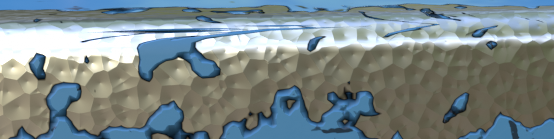
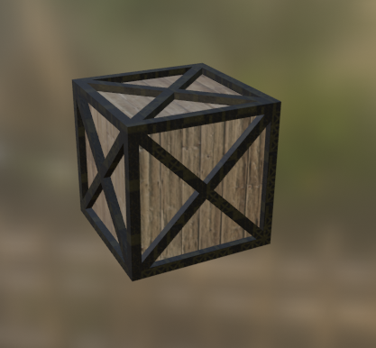

# Final Render

# Models
- Robot
- walls, ground, pillar
- wall light
- sledge hammer
- wooden crate
- wooden palette
- handsaw

 

# Robot

For the most part of the work, I did not have any idea of what I wanted the final scene to look like so I just started doing stuff.  
First model I made is a four legged robot inspired by the enemies in the indie game ScrapMechanic

#### The enemies in question:

 

The robot is composed of 3 models: the body, the legs, and the arm.

I started with the **body**.
### ***process***:
Circle of 6 vertices, extruded vertically, filled the gaps. 
I used the auto-mirror addon to mirror the work done on one side. 
I used a UV sphere and a boolean modifier to make a sphere hole for the legs joints. 

As for the eye, i used inset on the front face, then subdivided the inner square and then translate the middle point with proportional editing to get the eye shape. (I change the eye later by a torus and a sphere because i realized it was simpler to make a model out of multiple shapes than the same connected mesh) 

The arm is a single segment that I duplicated and put on top of each of other scaling it down a bit each time. 

The leg is the most detailed part of the robot's mesh. But not very interesting to explain in details as it's just a lot of simple operation (A bunch of shapes put together, loop cuts, bevels ...) 

## Armature
For the armature i used bones instead of simple object parenting because I wanted to use inverse kinematics to make the job of animating it for the Unreal Animation easier (turned out that IK is difficult)
I also added rotation constraints on the leg tips and on the whole arm to make it easier to position later.

<!-- constraints -->

## Materials
For the robot's material I did not use any textures and I made a fully procedural "**Scratched Metal**" material

The entire material is encapsulated inside a group node as we can see here.

What's inside the material (group node)

The material is composed of 3 components
- The underlying metal

- The paint

- The edge wear

no edge wear

 

with edge wear

 

Everything put together

That's all for the robot !

 

> Next i started making the rest of the scene in where the robot was gonna be rendered.

 

# Environment
The environment is composed of 3 simple objects
- The floor
- 2 walls
- 3 pillars

For each of them I used free texture found on internet to make the materials.
Textures composed of **color**, **roughness**, **normals** and **displacement**.

 

To create a material using these textures, I create a new material. 

Then I use the node-wrangler builtin addon and select the BSDF and press **Ctrl + Shift + T**.
It open a file prompt where I select the 4 textures and it automatically link them by detecting the word in the file names.

 

> explain the UV unwrapping

I do this for the 3 models and here is the result.

 

# Wall light

Just some simple geometry with a dark black material and an emissive one for the light parts of the mesh.

Placed in the scene.

 

# Sledge hammer

Simple model, nothing special, I used the node wrangler and some free textures for the metal head.

 

# Wooden crate

Another simple model that uses 2 textures.
I had to use a colorRamp to lighten the wood and darken the other to make it look better.

 

# Wooden palette

Again another simple model that uses 2 textures.
Had to move manually the uv map for the edge faces of the botton planks to place them at good places on the trunk texture.

 

# Handsaw

I used a reference image for this model and the path tool to make the handle that i then converted to a mesh.

  

# Compositing

For the final render I placed in some coherent way the simple models in the background of scene.
And i duplicated the robot and gave a different color to the new one. I use the armature to position them in like if they are fighting each other.

And a last touch for the render is some depth of field to give more attention on the robots fighting in front of the camera.

  

# Conclusion

I'm happy of what I've accomplished to do globally. But there's a lot of part that I would do differently if I had to do it again. 
For example, the idea of making an object of multiples meshes instead of a single connected one (like the robot's eye that I actually changed at the end). Because of that, I have lost a lot of time at the beginning and on the robot. The tail of the robot have this problem even thought i did not mention it. 
Also the robot's armature is difficult to work with and to select, i did not do a great job on parenting objects.
I couldn't make a walking animation for the unreal Animation because too difficult without Inverse Kinematics.

  

# Resources

Almost all textures come from this website https://www.cgbookcase.com/

## modeling
https://youtu.be/WtNpGZGZbr0  
https://youtu.be/O_Cyz9WBH9U  
https://youtu.be/g-4l3c42GaQ  

## procedural materials
https://youtu.be/hEH8TsGM78o  
https://youtu.be/_KXXyPd83s0  
https://youtu.be/1iBEwV0BgCY  

## Armature / rigging
https://youtu.be/8Yb7_Ao6QHM  
https://youtu.be/yFxrqgUfbmc  
https://youtu.be/J1He21vDIfQ  

## Texturing / baking
https://youtu.be/HweuUl81qtw  
https://youtu.be/NQMtZi9j5d0  
https://youtu.be/wG6ON8wZYLc  
